# Numerical Integration Methods in C

<p align="center">
  A comprehensive C implementation and comparative analysis of the Rectangle, Trapezoidal, and Monte Carlo methods for numerical integration.
</p>

<p align="center">
  
  
  
</p>

---

## 📋 Table of Contents

- [Numerical Integration Methods in C](#numerical-integration-methods-in-c)
  - [📋 Table of Contents](#-table-of-contents)
  - [🚀 Getting Started](#-getting-started)
    - [Prerequisites](#prerequisites)
    - [Compilation \& Execution](#compilation--execution)
  - [🛠️ Code Architecture](#️-code-architecture)
    - [File Structure](#file-structure)
    - [Key Design Features](#key-design-features)
  - [📚 Methodology: Numerical Integration Techniques](#-methodology-numerical-integration-techniques)
    - [Rectangle Method (Midpoint Rule)](#rectangle-method-midpoint-rule)
    - [Trapezoidal Method](#trapezoidal-method)
    - [Monte Carlo Method](#monte-carlo-method)
  - [💡 Implementation Details](#-implementation-details)
    - [Flowcharts \& Pseudocode](#flowcharts--pseudocode)
  - [📊 Analysis and Results](#-analysis-and-results)
    - [Test Functions \& Analytical Solutions](#test-functions--analytical-solutions)
      - [Function 1: `f(x) = -3.13x³ + 14.5x² - 6x + 7`](#function-1-fx---313x--145x---6x--7)
      - [Function 2: `f(x) = 0.5cos(2x²)sin(8x²) - 3cos(5 + x) + 1`](#function-2-fx--05cos2xsin8x---3cos5--x--1)
      - [Function 3: `f(x) = 0.1x³ + 2x² + 0.5x + 5`](#function-3-fx--01x--2x--05x--5)
      - [Function 4: `f(x) = x³sin(2x) + cos(x)`](#function-4-fx--xsin2x--cosx)
    - [Numerical Results](#numerical-results)
      - [**Rectangle Method Results**](#rectangle-method-results)
      - [**Trapezoidal Method Results**](#trapezoidal-method-results)
      - [**Monte Carlo Method Results**](#monte-carlo-method-results)
  - [🏆 Conclusion](#-conclusion)
    - [Accuracy Comparison](#accuracy-comparison)
    - [Computational Complexity](#computational-complexity)
    - [Use-Case Recommendations](#use-case-recommendations)
    - [Choosing the Right Method](#choosing-the-right-method)
  - [📜 License](#-license)

---

## 🚀 Getting Started

Follow these instructions to compile and run the project on your local machine.

### Prerequisites

-   A C compiler (e.g., GCC)
-   `make` build automation tool

### Compilation & Execution

1.  **Clone the repository:**
    ```bash
    git clone [your-repository-address]
    cd [directory-name]
    ```

2.  **Use the provided `Makefile`:**
    The `Makefile` simplifies the entire process. The most common commands are:
    ```bash
    # Build the project
    make all

    # Build and run the executable immediately
    make run

    # Clean up build artifacts
    make clean
    ```

3.  **Run the program:**
    After executing `make run`, you will be prompted to enter the integration limits. The program will then output the calculated integrals for all test functions.
    ```
    Enter integration start point: -5
    Enter integration end point: 5
    ```

---

## 🛠️ Code Architecture

The project is organized into a modular and maintainable structure.

### File Structure

-   `main.c`: The entry point of the application. It handles user input for integration bounds and orchestrates the calls to the integration functions, displaying the final results.
-   `numerical_integration.c`: Contains the core logic, including the definitions of the four test functions and the full implementations of the `rectangle_rule`, `trapezoidal_rule`, and `monte_carlo_integration` algorithms.
-   `numerical_integration.h`: The header file providing function prototypes, constant definitions (like `NUM_SUBDIVISIONS`), and the `MathFunction` type definition for generic function pointers.

### Key Design Features

-   **Modularity**: Code is logically separated into interface (`.h`) and implementation (`.c`) files.
-   **Function Pointers**: The use of `typedef double (*MathFunction)(double);` allows the integration algorithms to be generic, accepting any compatible mathematical function as an argument.
-   **Global State**: Integration bounds are managed as global variables (`integration_start`, `integration_end`) to simplify function signatures for this specific project.

---

## 📚 Methodology: Numerical Integration Techniques

This project implements and analyzes three distinct methods for approximating definite integrals.

### Rectangle Method (Midpoint Rule)

This method approximates the area under a curve by summing the areas of rectangles. The implementation uses the **midpoint rule**, where the height of each rectangle is determined by the function's value at the center of its base. This variant is generally more accurate than the left- or right-hand rules as it tends to balance out over- and under-estimations.

### Trapezoidal Method

The trapezoidal method improves upon the rectangle method by approximating the area using trapezoids instead of rectangles. Each trapezoid is formed by connecting adjacent points on the curve with a straight line. This approach more closely fits the curvature of the function, leading to higher accuracy, especially for functions that are not highly oscillatory.

### Monte Carlo Method

A probabilistic method that estimates the integral by random sampling. It operates by defining a bounding box around the function's area over the integration interval and generating a large number of random points within this box.

> The integral is estimated as the area of the bounding box multiplied by the ratio of points that fall "under" the curve to the total number of points generated. The implementation handles both positive and negative function values by treating their areas separately.

---

## 💡 Implementation Details

The algorithms are visualized below through flowcharts and pseudocode.

### Flowcharts & Pseudocode

<details>
<summary><strong>Click to view the flowchart for the `same_numbers` utility function</strong></summary>
<p align="center">
  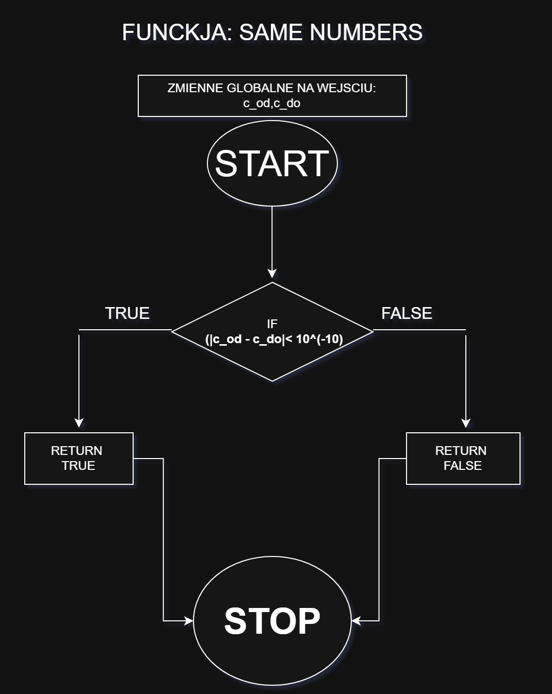
</p>
</details>

<details>
<summary><strong>Click to view the flowchart for the Rectangle Method</strong></summary>
<p align="center">
  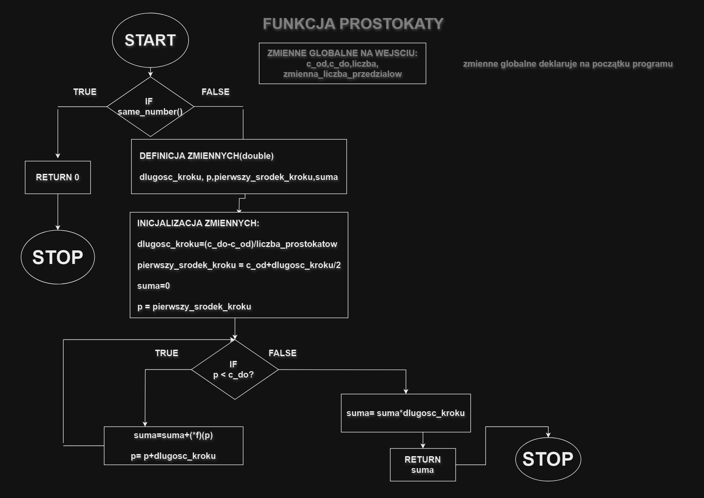
</p>
</details>

<details>
<summary><strong>Click to view the flowchart for the Trapezoidal Method</strong></summary>
<p align="center">
  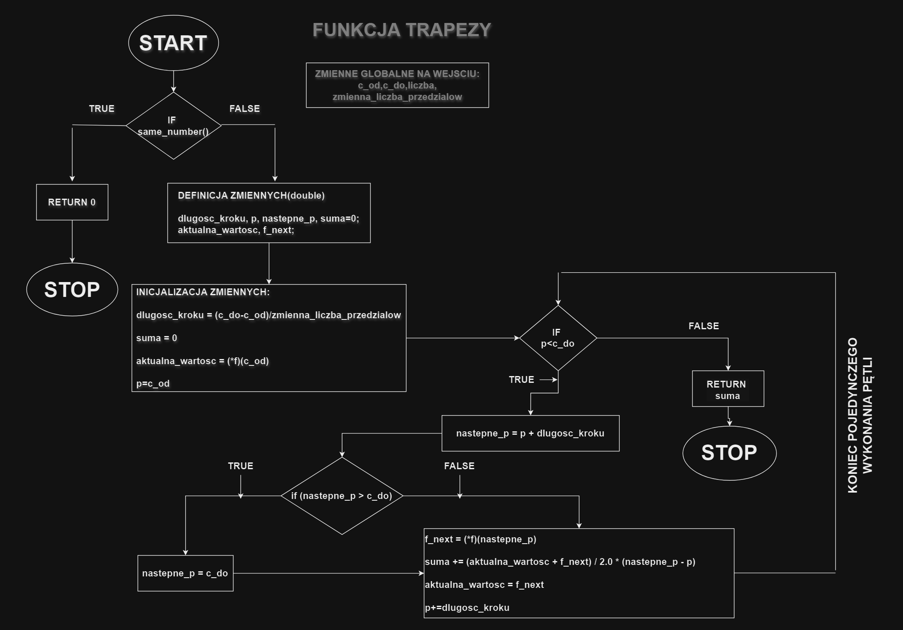
</p>
</details>

<details>
<summary><strong>Click to view the pseudocode for the Monte Carlo Method</strong></summary>

```pseudocode
function monte_carlo_integration(f)
    // 1. Handle edge case
    if integration_start is approx. integration_end then
        return 0
    
    // 2. Define integration domain
    interval_width = integration_end - start_point
    
    // 3. Find function bounds (min/max y-values)
    //    (Sample the function across the interval to find max_y and min_y)
    
    // 4. Define positive and negative bounding boxes
    positive_bound = if max_y > 0 then max_y else 0
    negative_bound = if min_y < 0 then min_y else 0
    
    // 5. Initialize random sampler and counters
    
    // 6. Perform random sampling
    loop for a large number of points:
        // Generate random (x, y) coordinates within the bounding boxes
        x_rand = start_point + random() * interval_width
        y_rand_pos = random() * positive_bound
        y_rand_neg = negative_bound + random() * abs(negative_bound)
        
        // Evaluate function at x_rand
        y_actual = f(x_rand)
        
        // Count "hits"
        if y_actual > 0 and y_rand_pos <= y_actual then
            increment positive_hits
        else if y_actual < 0 and y_rand_neg >= y_actual then
            increment negative_hits
    
    // 7. Calculate area based on ratios
    positive_area = (positive_hits / num_points) * interval_width * positive_bound
    negative_area = (negative_hits / num_points) * interval_width * abs(negative_bound)
    
    // 8. Return final integral value
    return positive_area - negative_area
```
</details>

---

## 📊 Analysis and Results

The methods were tested against four different functions over the interval `[-5, 5]`.

### Test Functions & Analytical Solutions

#### Function 1: `f(x) = -3.13x³ + 14.5x² - 6x + 7`
<p align="center">
  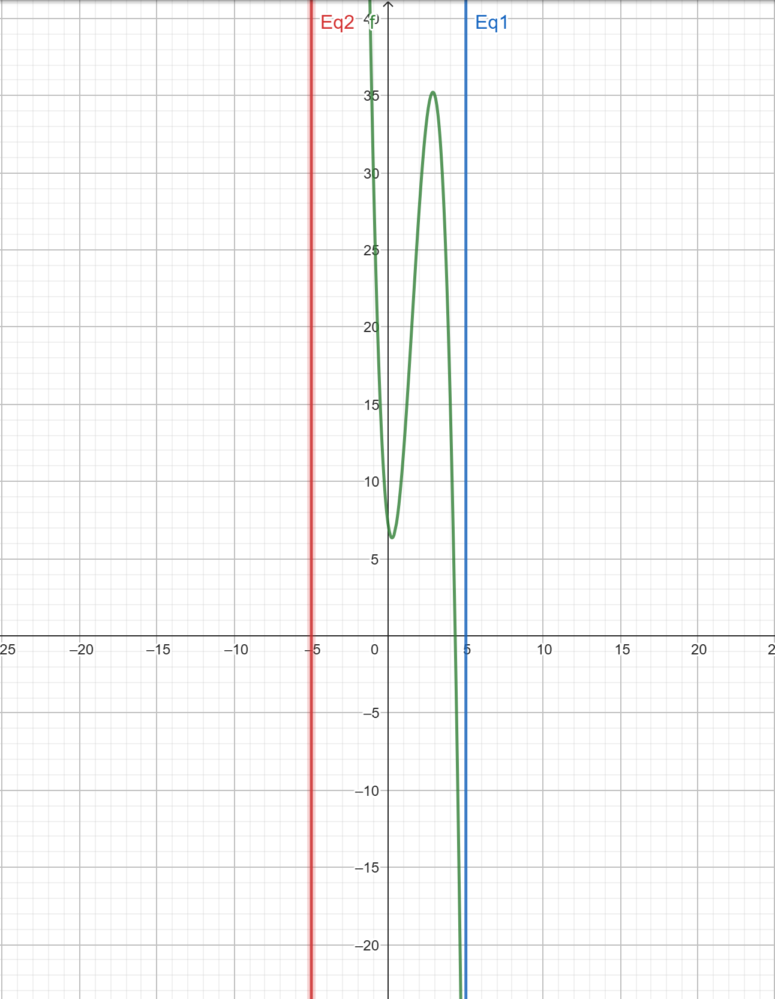
  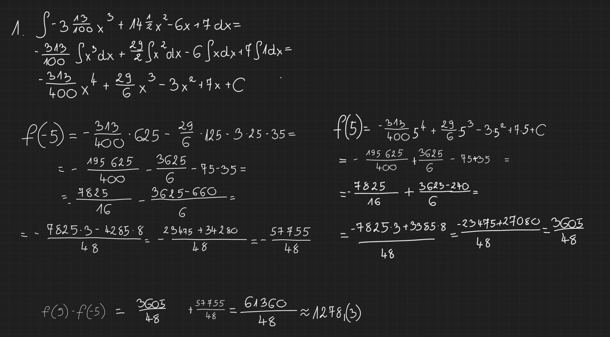
</p>

#### Function 2: `f(x) = 0.5cos(2x²)sin(8x²) - 3cos(5 + x) + 1`
<p align="center">
  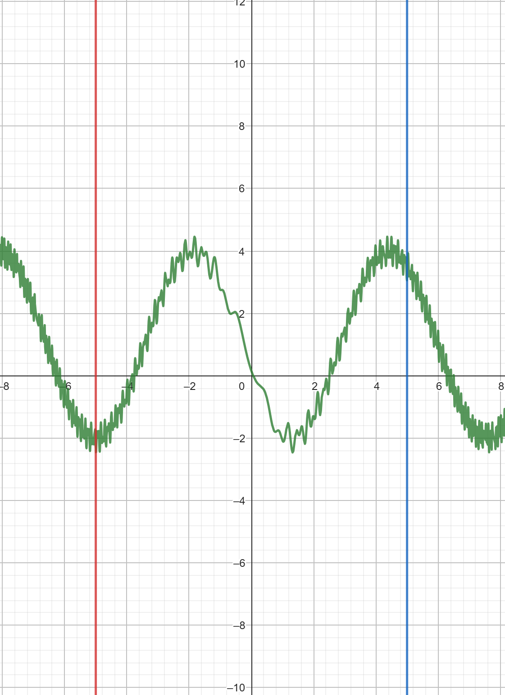
  
</p>

#### Function 3: `f(x) = 0.1x³ + 2x² + 0.5x + 5`
<p align="center">
  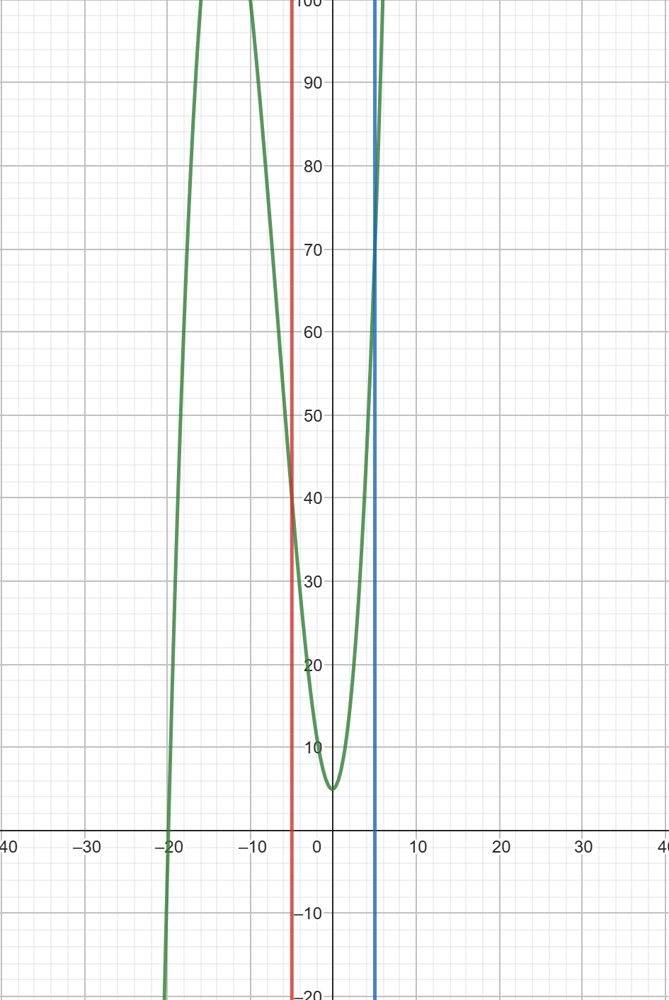
  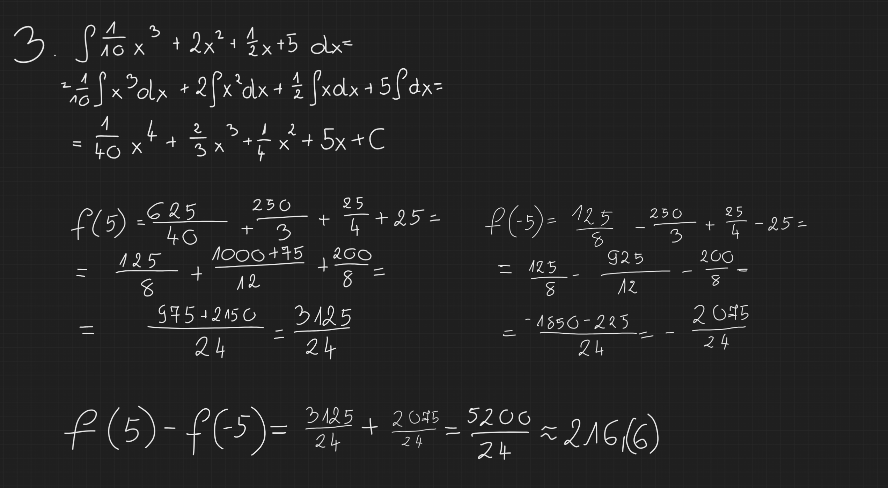
</p>

#### Function 4: `f(x) = x³sin(2x) + cos(x)`
<p align="center">
  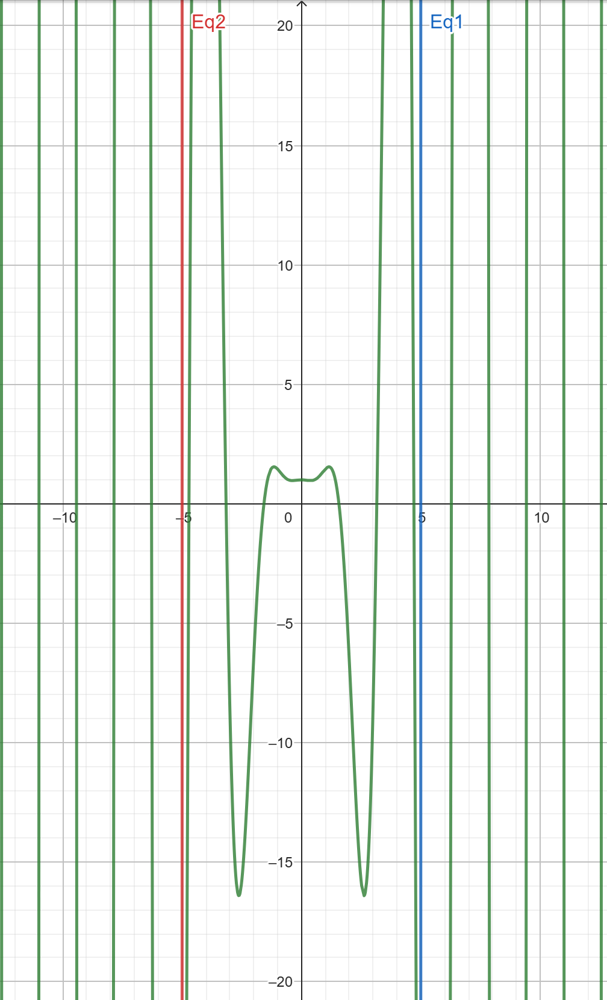
  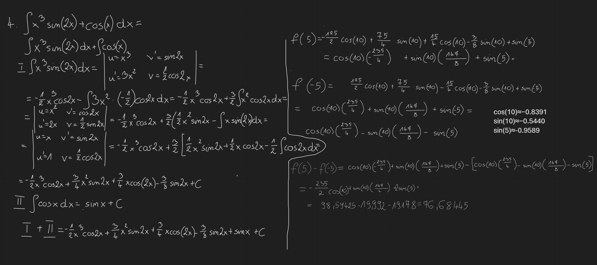
</p>

### Numerical Results

The following tables (presented as images) show the convergence and accuracy of each method as the number of subdivisions or points increases.

#### **Rectangle Method Results**
<p align="center">
  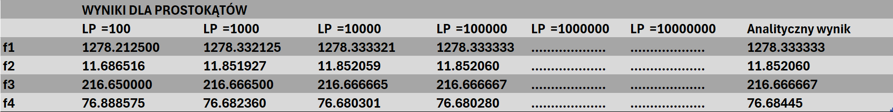
</p>

#### **Trapezoidal Method Results**
<p align="center">
  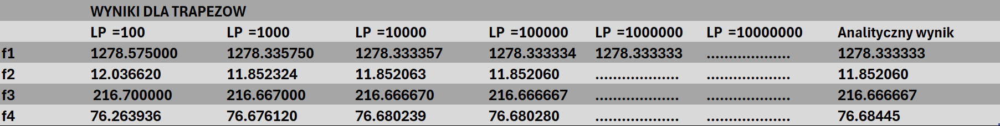
</p>

#### **Monte Carlo Method Results**
<p align="center">
  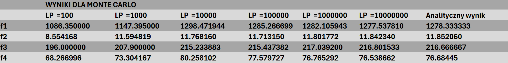
</p>
> **Note:** The dots on the Monte Carlo graph indicate that the result repeated for a higher number of points, highlighting the method's stochastic convergence.

---

## 🏆 Conclusion

### Accuracy Comparison
-   **Rectangle & Trapezoidal Methods**: Both are highly effective, achieving good accuracy with a relatively small number of subdivisions (100-1000). The **Trapezoidal Method** consistently outperforms the Rectangle Method, especially for functions with significant curvature.
-   **Monte Carlo Method**: Requires a much larger number of samples (e.g., 100,000+) to approach comparable accuracy. Its results are non-deterministic and exhibit variance between runs.

### Computational Complexity
-   **Rectangle & Trapezoidal Methods**: Both have a linear time complexity of **O(n)**, where *n* is the number of subdivisions. They are deterministic.
-   **Monte Carlo Method**: Also has a linear time complexity of **O(n)**, where *n* is the number of random points. However, its convergence rate is slower.

### Use-Case Recommendations
-   **Rectangle Method**: Ideal for **simple, relatively smooth functions** where computational speed is paramount and high precision is not required.
-   **Trapezoidal Method**: The **best all-rounder** for typical one-dimensional integrals, offering an excellent balance of accuracy and performance.
-   **Monte Carlo Method**: Indispensable for **high-dimensional integrals** (where other methods suffer from the curse of dimensionality) and for functions that are **discontinuous or have complex boundaries**.

### Choosing the Right Method
The **Trapezoidal Method** is the recommended choice for most standard, one-dimensional integration problems. For simpler cases, the **Rectangle Method** suffices. The **Monte Carlo Method**, while less precise for simple problems, is a uniquely powerful tool for complex, multi-dimensional domains where deterministic methods fail.

---

## 📜 License

This project is licensed under the MIT License. See the [LICENSE](LICENSE) file for details.