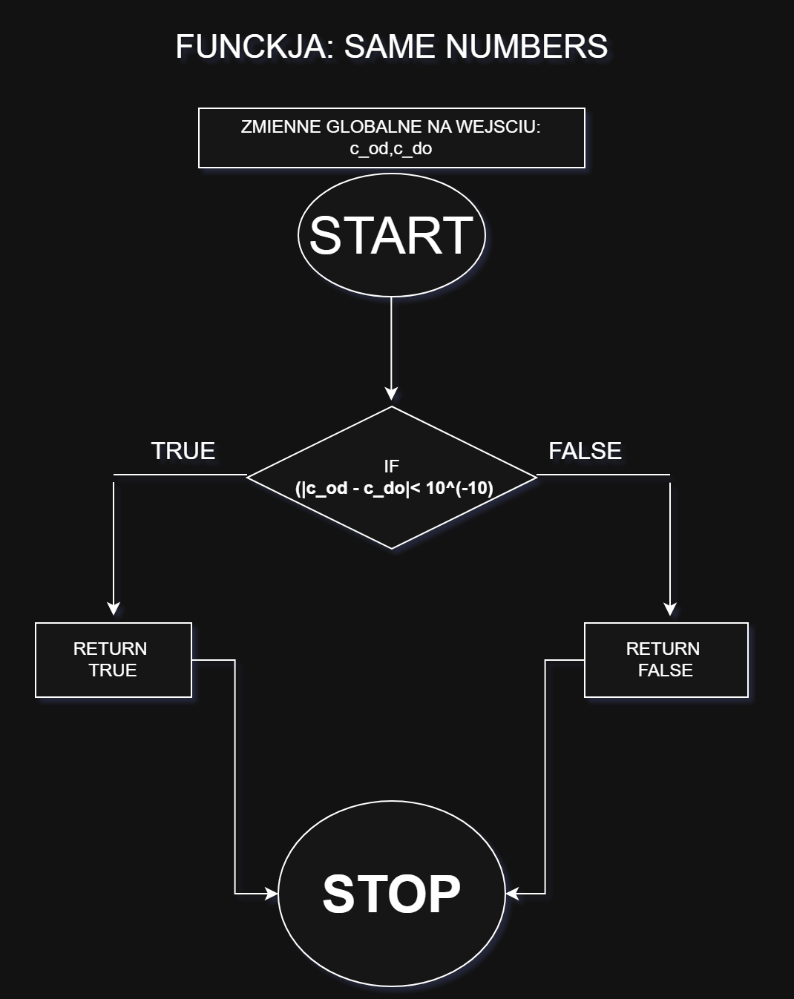
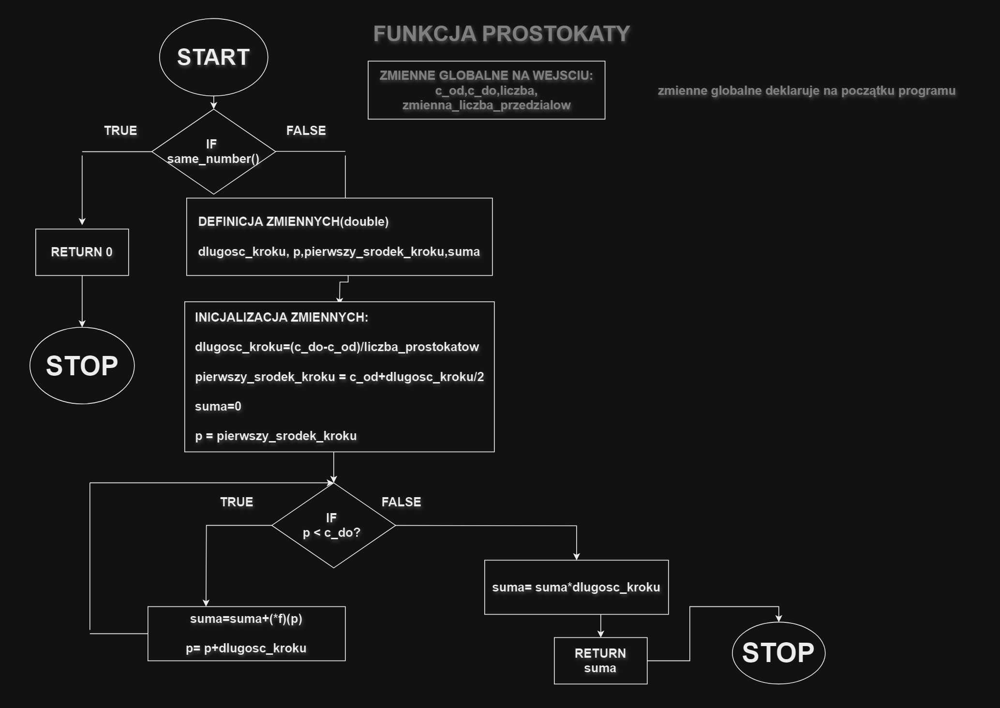
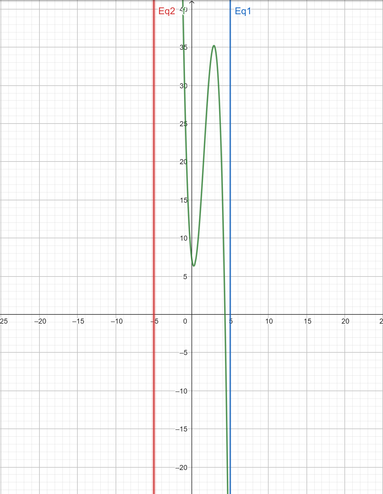
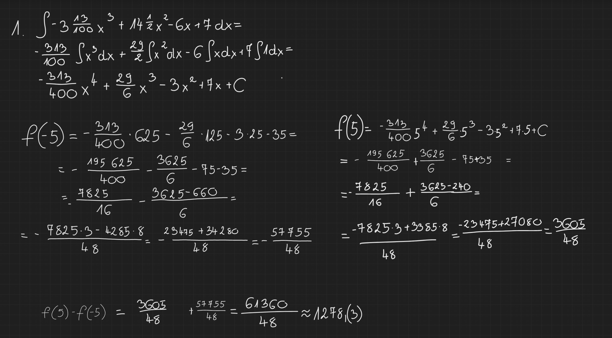
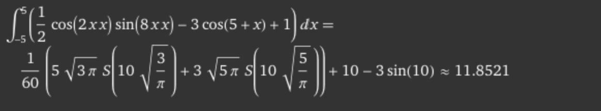
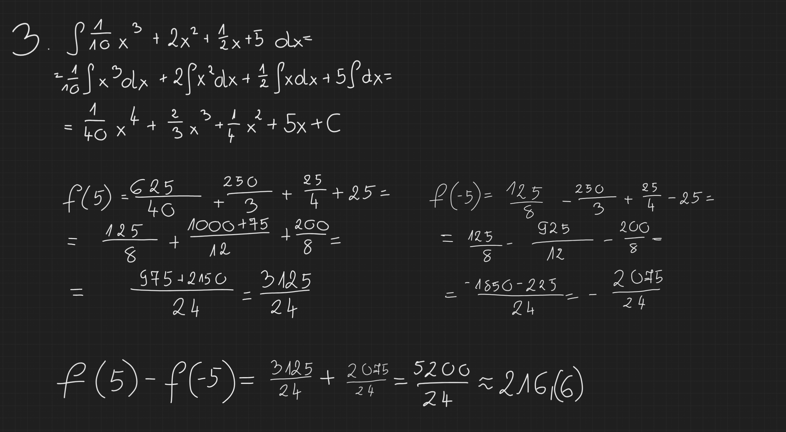
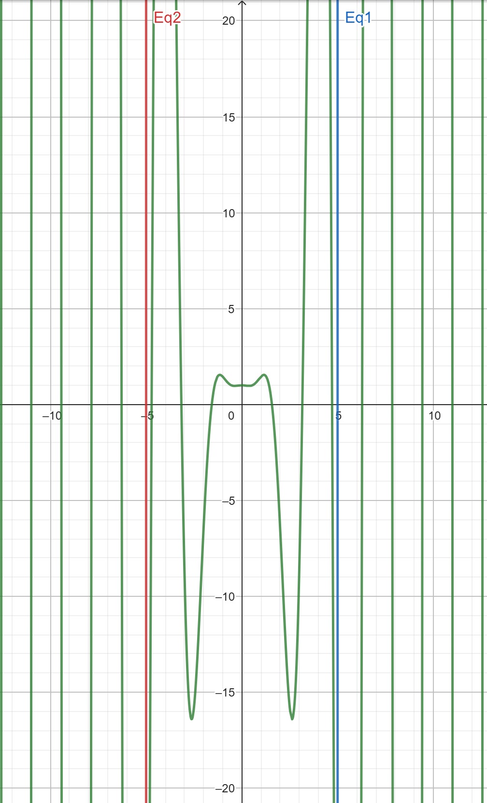
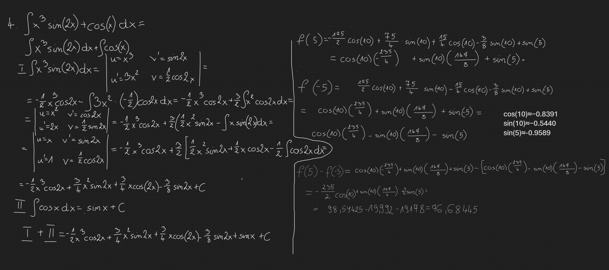

# Metody Całkowania Numerycznego w Języku C

<p align="center">
  Kompleksowa implementacja i analiza porównawcza metod całkowania numerycznego: metody prostokątów, trapezów oraz Monte Carlo.
</p>

<p align="center">
  
  
  
</p>

---

## 📋 Spis Treści

- [Metody Całkowania Numerycznego w Języku C](#metody-całkowania-numerycznego-w-języku-c)
  - [📋 Spis Treści](#-spis-treści)
  - [🚀 Pierwsze Kroki](#-pierwsze-kroki)
    - [Wymagania Wstępne](#wymagania-wstępne)
    - [Kompilacja i Uruchomienie](#kompilacja-i-uruchomienie)
  - [🛠️ Architektura Kodu](#️-architektura-kodu)
    - [Struktura Plików](#struktura-plików)
    - [Kluczowe Cechy Projektu](#kluczowe-cechy-projektu)
  - [📚 Metodologia: Techniki Całkowania Numerycznego](#-metodologia-techniki-całkowania-numerycznego)
    - [Metoda Prostokątów (Reguła Środkowa)](#metoda-prostokątów-reguła-środkowa)
    - [Metoda Trapezów](#metoda-trapezów)
    - [Metoda Monte Carlo](#metoda-monte-carlo)
  - [💡 Szczegóły Implementacji](#-szczegóły-implementacji)
    - [Schematy Blokowe i Pseudokod](#schematy-blokowe-i-pseudokod)
  - [📊 Analiza i Wyniki](#-analiza-i-wyniki)
    - [Funkcje Testowe i Rozwiązania Analityczne](#funkcje-testowe-i-rozwiązania-analityczne)
      - [Funkcja 1: `f(x) = -3.13x³ + 14.5x² - 6x + 7`](#funkcja-1-fx---313x--145x---6x--7)
      - [Funkcja 2: `f(x) = 0.5cos(2x²)sin(8x²) - 3cos(5 + x) + 1`](#funkcja-2-fx--05cos2xsin8x---3cos5--x--1)
      - [Funkcja 3: `f(x) = 0.1x³ + 2x² + 0.5x + 5`](#funkcja-3-fx--01x--2x--05x--5)
      - [Funkcja 4: `f(x) = x³sin(2x) + cos(x)`](#funkcja-4-fx--xsin2x--cosx)
    - [Wyniki Numeryczne](#wyniki-numeryczne)
      - [**Wyniki Metody Prostokątów**](#wyniki-metody-prostokątów)
      - [**Wyniki Metody Trapezów**](#wyniki-metody-trapezów)
      - [**Wyniki Metody Monte Carlo**](#wyniki-metody-monte-carlo)
  - [🏆 Wnioski](#-wnioski)
    - [Porównanie Dokładności](#porównanie-dokładności)
    - [Złożoność Obliczeniowa](#złożoność-obliczeniowa)
    - [Rekomendacje Zastosowań](#rekomendacje-zastosowań)
    - [Wybór Odpowiedniej Metody](#wybór-odpowiedniej-metody)
  - [📜 Licencja](#-licencja)

---

## 🚀 Pierwsze Kroki

Postępuj zgodnie z poniższymi instrukcjami, aby skompilować i uruchomić projekt na swojej maszynie.

### Wymagania Wstępne

-   Kompilator języka C (np. GCC)
-   Narzędzie do automatyzacji budowania `make`

### Kompilacja i Uruchomienie

1.  **Sklonuj repozytorium:**
    ```bash
    git clone [adres-twojego-repozytorium]
    cd [nazwa-katalogu]
    ```

2.  **Skorzystaj z dołączonego `Makefile`:**
    Plik `Makefile` upraszcza cały proces. Najczęściej używane polecenia to:
    ```bash
    # Kompiluje projekt
    make all

    # Kompiluje i natychmiast uruchamia program
    make run

    # Usuwa pliki wynikowe kompilacji
    make clean
    ```

3.  **Uruchom program:**
    Po wykonaniu `make run`, zostaniesz poproszony o podanie granic całkowania. Program obliczy i wyświetli wyniki dla wszystkich funkcji testowych.
    ```
    Podaj początek przedziału całkowania: -5
    Podaj koniec przedziału całkowania: 5
    ```

---

## 🛠️ Architektura Kodu

Projekt został zorganizowany w sposób modułowy, co ułatwia jego utrzymanie i rozbudowę.

### Struktura Plików

-   `main.c`: Punkt wejściowy aplikacji. Odpowiada za interakcję z użytkownikiem, wczytywanie granic całkowania oraz wywoływanie funkcji całkujących i prezentację wyników.
-   `numerical_integration.c`: Zawiera całą logikę obliczeniową, w tym definicje czterech funkcji testowych oraz implementacje algorytmów: `rectangle_rule`, `trapezoidal_rule` i `monte_carlo_integration`.
-   `numerical_integration.h`: Plik nagłówkowy zawierający prototypy funkcji, definicje stałych (np. `NUM_SUBDIVISIONS`) oraz definicję typu `MathFunction` dla generycznych wskaźników na funkcje.

### Kluczowe Cechy Projektu

-   **Modularność**: Kod jest logicznie podzielony na interfejs (`.h`) i implementację (`.c`).
-   **Wskaźniki na funkcje**: Użycie `typedef double (*MathFunction)(double);` sprawia, że algorytmy całkujące są uniwersalne i mogą przyjmować dowolną zgodną funkcję matematyczną jako argument.
-   **Stan Globalny**: Granice całkowania są zarządzane jako zmienne globalne (`integration_start`, `integration_end`), co upraszcza sygnatury funkcji w ramach tego konkretnego projektu.

---

## 📚 Metodologia: Techniki Całkowania Numerycznego

Projekt implementuje i analizuje trzy różne metody aproksymacji całek oznaczonych.

### Metoda Prostokątów (Reguła Środkowa)

Metoda ta przybliża pole pod wykresem funkcji poprzez sumowanie pól prostokątów. Zaimplementowany wariant to **reguła środkowa**, w której wysokość każdego prostokąta jest określana przez wartość funkcji w środku jego podstawy. Jest to zazwyczaj dokładniejszy wariant niż reguły lewostronna czy prawostronna, ponieważ błędy niedoszacowania i przeszacowania mają tendencję do wzajemnego znoszenia się.

### Metoda Trapezów

Metoda trapezów stanowi ulepszenie metody prostokątów, aproksymując pole za pomocą trapezów. Każdy trapez jest tworzony przez połączenie sąsiednich punktów na krzywej linią prostą. Takie podejście lepiej oddaje krzywiznę funkcji, co prowadzi do wyższej dokładności, zwłaszcza dla funkcji o niskiej oscylacji.

### Metoda Monte Carlo

Jest to metoda probabilistyczna, która szacuje wartość całki na podstawie losowego próbkowania. Jej działanie polega na zdefiniowaniu prostokątnego obszaru (tzw. *bounding box*) wokół pola całkowania i wygenerowaniu w jego obrębie dużej liczby losowych punktów.

> Wartość całki jest szacowana jako pole prostokątnego obszaru pomnożone przez stosunek liczby punktów, które znalazły się "pod" wykresem, do całkowitej liczby wygenerowanych punktów. Implementacja obsługuje zarówno dodatnie, jak i ujemne wartości funkcji, traktując ich pola oddzielnie.

---

## 💡 Szczegóły Implementacji

Algorytmy zostały zwizualizowane poniżej za pomocą schematów blokowych i pseudokodu.

### Schematy Blokowe i Pseudokod

<details>
<summary><strong>Kliknij, aby zobaczyć schemat blokowy funkcji pomocniczej `same_numbers`</strong></summary>
<p align="center">
  
</p>
</details>

<details>
<summary><strong>Kliknij, aby zobaczyć schemat blokowy Metody Prostokątów</strong></summary>
<p align="center">
  
</p>
</details>

<details>
<summary><strong>Kliknij, aby zobaczyć schemat blokowy Metody Trapezów</strong></summary>
<p align="center">
  
</p>
</details>

<details>
<summary><strong>Kliknij, aby zobaczyć pseudokod Metody Monte Carlo</strong></summary>

```pseudocode
funkcja monte_carlo_integration(f)
    // 1. Obsługa przypadku brzegowego
    jeżeli początek_całki jest bliski końcowi_całki then
        zwróć 0
    
    // 2. Definicja dziedziny całkowania
    szerokość_przedziału = koniec_całki - początek_całki
    
    // 3. Znalezienie granic funkcji (min/max wartości y)
    //    (Próbkowanie funkcji w przedziale w celu znalezienia max_y i min_y)
    
    // 4. Definicja prostokątów ograniczających dla wartości dodatnich i ujemnych
    granica_dodatnia = jeżeli max_y > 0 to max_y w przeciwnym razie 0
    granica_ujemna = jeżeli min_y < 0 to min_y w przeciwnym razie 0
    
    // 5. Inicjalizacja generatora losowego i liczników
    
    // 6. Przeprowadzenie losowego próbkowania
    pętla dla dużej liczby punktów:
        // Generuj losowe współrzędne (x, y) w prostokątach ograniczających
        x_los = początek_całki + losowa() * szerokość_przedziału
        y_los_dodatni = losowa() * granica_dodatnia
        y_los_ujemny = granica_ujemna + losowa() * abs(granica_ujemna)
        
        // Oblicz wartość funkcji dla x_los
        y_rzeczywisty = f(x_los)
        
        // Zliczaj "trafienia"
        jeżeli y_rzeczywisty > 0 i y_los_dodatni <= y_rzeczywisty then
            zwiększ licznik_trafień_dodatnich
        inaczej jeżeli y_rzeczywisty < 0 i y_los_ujemny >= y_rzeczywisty then
            zwiększ licznik_trafień_ujemnych
    
    // 7. Oblicz pole na podstawie stosunków trafień
    pole_dodatnie = (licznik_trafień_dodatnich / liczba_punktów) * szerokość_przedziału * granica_dodatnia
    pole_ujemne = (licznik_trafień_ujemnych / liczba_punktów) * szerokość_przedziału * abs(granica_ujemna)
    
    // 8. Zwróć ostateczną wartość całki
    zwróć pole_dodatnie - pole_ujemne
```
</details>

---

## 📊 Analiza i Wyniki

Metody zostały przetestowane na czterech różnych funkcjach w przedziale `[-5, 5]`.

### Funkcje Testowe i Rozwiązania Analityczne

#### Funkcja 1: `f(x) = -3.13x³ + 14.5x² - 6x + 7`
<p align="center">
  
  
</p>

#### Funkcja 2: `f(x) = 0.5cos(2x²)sin(8x²) - 3cos(5 + x) + 1`
<p align="center">
  
  
</p>

#### Funkcja 3: `f(x) = 0.1x³ + 2x² + 0.5x + 5`
<p align="center">
  
  
</p>

#### Funkcja 4: `f(x) = x³sin(2x) + cos(x)`
<p align="center">
  
  
</p>

### Wyniki Numeryczne

Poniższe tabele (przedstawione jako obrazy) ilustrują zbieżność i dokładność każdej z metod w miarę wzrostu liczby podziałów lub punktów.

#### **Wyniki Metody Prostokątów**
<p align="center">
  
</p>

#### **Wyniki Metody Trapezów**
<p align="center">
  
</p>

#### **Wyniki Metody Monte Carlo**
<p align="center">
  
</p>
> **Uwaga:** Kropki na wykresie Monte Carlo wskazują, że wynik powtórzył się dla większej liczby punktów, co podkreśla stochastyczny charakter zbieżności tej metody.

---

## 🏆 Wnioski

### Porównanie Dokładności
-   **Metoda Prostokątów i Trapezów**: Obie metody są bardzo skuteczne i osiągają dobrą dokładność już przy niewielkiej liczbie podziałów (100-1000). **Metoda Trapezów** jest konsekwentnie dokładniejsza, zwłaszcza dla funkcji o wyraźnej krzywiźnie.
-   **Metoda Monte Carlo**: Wymaga znacznie większej liczby próbek (np. 100 000+), aby zbliżyć się do porównywalnej dokładności. Jej wyniki są niedeterministyczne i wykazują wariancję między kolejnymi uruchomieniami.

### Złożoność Obliczeniowa
-   **Metoda Prostokątów i Trapezów**: Obie mają liniową złożoność czasową **O(n)**, gdzie *n* to liczba podziałów. Są to metody deterministyczne.
-   **Metoda Monte Carlo**: Również ma liniową złożoność czasową **O(n)**, gdzie *n* to liczba losowych punktów, jednak jej tempo zbieżności jest wolniejsze.

### Rekomendacje Zastosowań
-   **Metoda Prostokątów**: Idealna dla **prostych, stosunkowo gładkich funkcji**, gdzie priorytetem jest szybkość obliczeń, a nie najwyższa precyzja.
-   **Metoda Trapezów**: **Najlepszy, uniwersalny wybór** dla typowych całek jednowymiarowych, oferujący doskonały balans między dokładnością a wydajnością.
-   **Metoda Monte Carlo**: Niezastąpiona dla **całek wielowymiarowych** (gdzie inne metody cierpią z powodu tzw. "klątwy wymiarowości") oraz dla funkcji **nieciągłych lub o skomplikowanych granicach**.

### Wybór Odpowiedniej Metody
**Metoda Trapezów** jest rekomendowanym wyborem dla większości standardowych, jednowymiarowych problemów całkowania. W prostszych przypadkach wystarczająca może być **Metoda Prostokątów**. Z kolei **Metoda Monte Carlo**, choć mniej precyzyjna dla prostych problemów, jest unikalnie potężnym narzędziem dla złożonych, wielowymiarowych dziedzin, w których metody deterministyczne zawodzą.

---

## 📜 Licencja

Ten projekt jest udostępniany na warunkach licencji MIT. Szczegóły znajdują się w pliku [LICENSE](LICENSE).